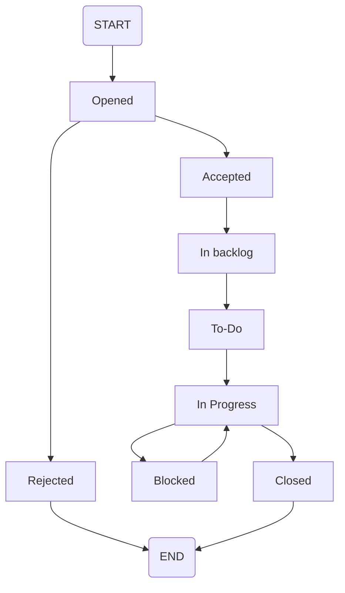

| Change ID       | CIAS-AD-001                                                                  |
| --------------- | ---------------------------------------------------------------------------- |
| **Raised By**   | John Smith <john.smith@email.com>                                            |
| **Date Raised** | 2025-01-01                                                                   |
| **Change Type** | Request for change / Feature Request / Off-specification / Concern / Problem |
| **Priority**    | Critical / Major / Minor / Info                                              |
| **Severity**    | Critical / Major / Minor / Info                                              |

## 1. Description

Please describe what is going on and the reasons/cause why you are reporing issue or requesting the change.

### 1.1. Impact of the request

*What is/will be impacted by the change*
- reference risks and opportunities
- describe benefits
- brief calculation of the ROI

### 1.2. Recommendation(s)

*Describe what is the expected behavior*

## 2. Decision

*Decision maker*

*Date of the decision*

*The description of final decision by the Project Board / Project Owner / Service Owner*

*Reasons and arguments for the decision*

*Not filled by user*

### 2.1. Risks

*List all potential dependencies and risks involved*

*Not filled by user*

### 2.2. Implementation

*The decision how the change shall be implemented*

*Not filled by user*

## 3. Change Request Status

*Opened / Accepted / Rejected / In backlog / To-Do / In progress / Blocked / Closed*

*Link to JIRA ticket.*

### 3.1. Changelog

*Document what was done in regard to this feature*

*Not filled by user*

#### 3.1.1. 2025-01-20

**Author**: David Smith <david.smith@email.com>

**2nd Party for Production**: Thomas Müller <thomas.muller@email.com>

- scope of the work done
- architectural changes
	- [ ] *have you updated relevant documentation*
- operational changes
	- [ ] *have you updated relevant documentation*
- user changes
	- [ ] *have you updated relevant documentation*
- testing changes
	- [ ] are the new tests required?
	- [ ] Unit testing - SUCCESS / CONDITIONAL / FAILED / NOT-REQUIRED
		- [ ] [link to the test plan](sample link)
		- [ ] [link to the results](sample link)
	- [ ] Integration testing - SUCCESS / CONDITIONAL / FAILED / NOT-REQUIRED
		- [ ] [link to the test plan](sample link)
		- [ ] [link to the results](sample link)
	- [ ] E2E testing - SUCCESS / CONDITIONAL / FAILED / NOT-REQUIRED
		- [ ] [link to the test plan](sample link)
		- [ ] [link to the results](sample link)
